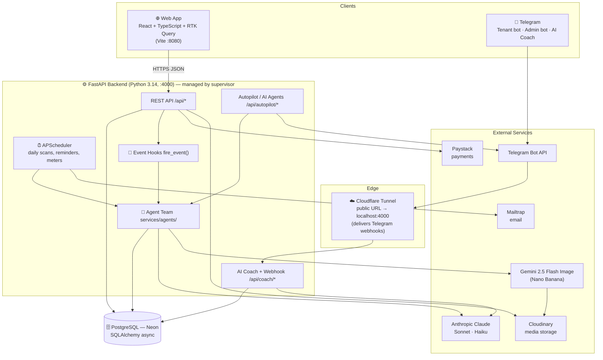
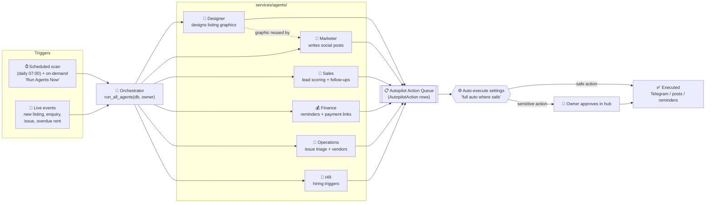
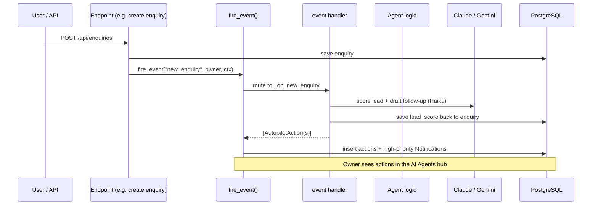
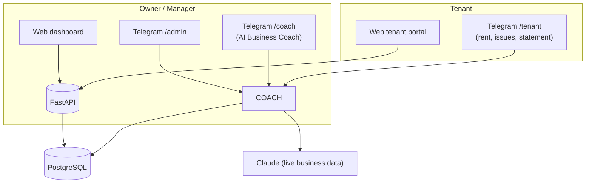
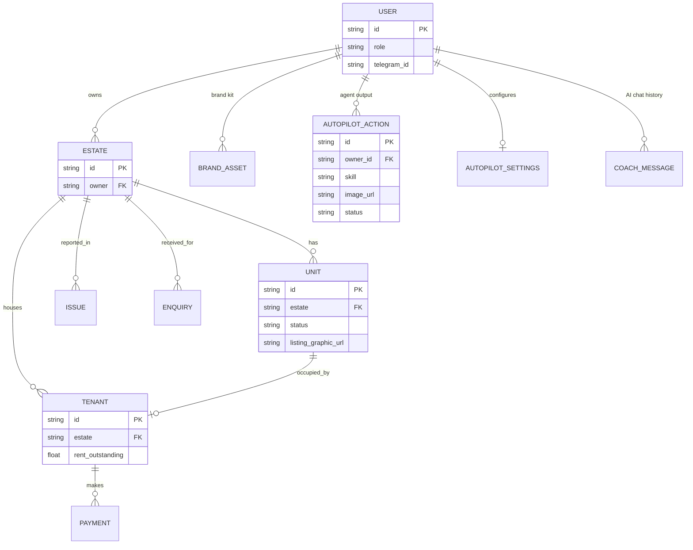
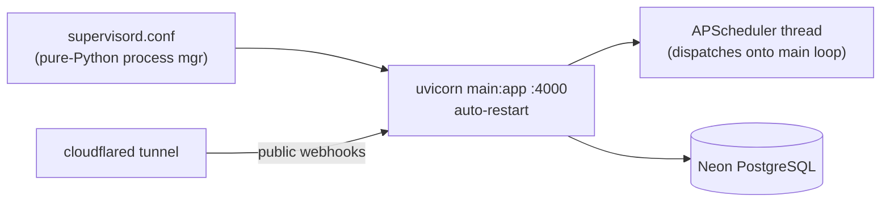
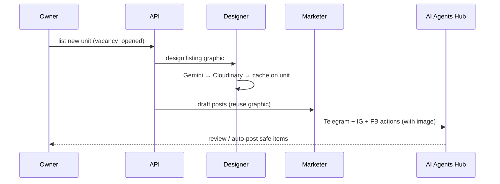

# Bami Host — System Architecture & Flow

> A full map of how the platform operates: the apps, the AI agent team, the
> event/scan flows, data, and external services.
> Mermaid diagrams render as images on GitHub / VS Code (Markdown Preview Mermaid).

---

## 1. High-level system map



---

## 2. The AI Agent Team (the core idea)

Six autonomous agents run in the **background**. There are no manual skill pages —
everything they do surfaces in the single **AI Agents hub** (`/dashboard/autopilot`).



**Run order matters:** Designer runs first and caches a marketing graphic on each
vacant unit; the Marketer then reuses that graphic in every social post.

### Per-agent responsibility & autonomy

| Agent | Trigger | Produces | Auto-runs? |
|-------|---------|----------|-----------|
| 🎨 Designer | new listing / vacancy | branded marketing graphic (cached on unit) | ✅ safe |
| 📣 Marketer | vacant units | Telegram/Instagram/Facebook posts + daily briefing | ✅ briefing only |
| 💼 Sales | pending enquiries | lead score + warm follow-up message | ⛔ approval |
| 💰 Finance | overdue rent | payment reminder; (payment links manual) | ✅ reminders |
| 🔧 Operations | open issues | maintenance action plan + best-vendor match | ✅ plans |
| 👥 HR | portfolio > 15 tenants | "time to hire" recommendation + draft role | ⛔ approval |

---

## 3. Event-driven flow (real-time reactions)

When something happens in the business, `fire_event()` fans it out to the agents.



**Events handled:** `new_tenant`, `vacancy_opened`, `new_enquiry`, `issue_reported`,
`payment_received`, `tenant_overdue`, `new_property_listed`, `lease_expiring`.

---

## 4. Scheduled autopilot scan (daily + on-demand)

```mermaid
sequenceDiagram
    participant SCH as APScheduler (07:00)
    participant ORCH as run_all_agents
    participant DESQ as Designer
    participant MKT as Marketer
    participant GEM as Gemini (Nano Banana)
    participant CLD as Cloudinary
    participant DB as PostgreSQL

    SCH->>ORCH: scan(owner)
    ORCH->>DESQ: scan() → for each vacant unit
    DESQ->>GEM: design listing graphic
    GEM-->>DESQ: image bytes
    DESQ->>CLD: upload → URL
    DESQ->>DB: cache unit.listing_graphic_url
    ORCH->>MKT: scan() → reuse graphic
    MKT->>DB: insert telegram/ig/fb actions (with image_url)
    ORCH->>DB: + Sales / Finance / Operations / HR actions
    Note over ORCH,DB: auto-safe actions execute; rest await approval
```

---

## 5. Three ways to use the system (channels)



The **AI Coach** auto-recognises an owner by their Telegram ID (`User.telegram_id`)
and pulls their live business data (estates, tenants, revenue, overdue, occupancy)
into every reply — no login needed.

---

## 6. Core data model (simplified)



> Note: child records (unit, tenant, issue, enquiry) link to an **estate**;
> ownership is resolved through `Estate.owner` (super_admin sees all).

---

## 7. External services & what they power

| Service | Used for | Key/Config |
|---------|----------|-----------|
| **Anthropic Claude** | Coach, all agent text (Sonnet = deep, Haiku = fast) | `ANTHROPIC_API_KEY` |
| **Gemini 2.5 Flash Image** ("Nano Banana") | Logo + marketing graphics | `GEMINI_API_KEY` |
| **Cloudinary** | Stores generated/uploaded images | `CLOUDINARY_*` |
| **Paystack** | Rent/service-charge payments, payment links | `PAYSTACK_SECRET_KEY` |
| **Telegram Bot API** | Tenant/admin bots, coach, agent message delivery | `TELEGRAM_BOT_TOKEN` |
| **Mailtrap** | Transactional email, campaigns | `MAILTRAP_TOKEN` |
| **Neon** | Managed PostgreSQL | `DATABASE_URL` |

---

## 8. Runtime / deployment



- **Process manager:** `supervisor` (Python). Start: `fastapi_app/venv/bin/supervisord -c supervisord.conf`
- **Always-on + auto-restart**, logs in `logs/`.
- **Schema:** `create_all` on startup — new columns/type changes need a manual
  `ALTER TABLE` (no Alembic yet).

---

## 9. End-to-end example — "a new flat is listed"



This is the workflow the owner asked for: *a property is listed → the Designer
creates the image → the Marketer ships the posts carrying that image.*
